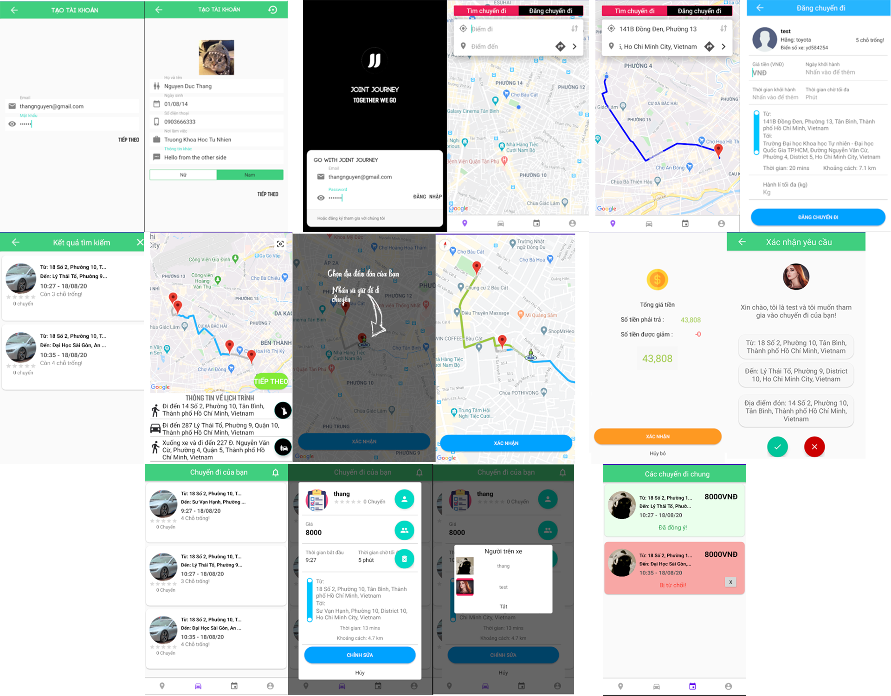

## JOINT JOURNEY
Xin chào, Joint Journey là một ứng dụng đi chung xe được viết bằng Java trên nền tảng Android. Đây là ứng dụng mình xây dựng cho đề tài tốt nghiệp. Các thông tin về người dùng và chuyến đi sẽ được lưu trữ trên Firebase. Ngoài ra kết hợp với Google API để nhúng bản đồ vào trong ứng dụng.    

## Hướng dẫn:
1.	Clone source code về :  
Git clone https://github.com/lishacee/JointJourney-backup.git
2.	Mở bằng Android Studio chọn Open an Existing Android Studio Project
3.	Chạy ứng dụng  
4. Để chạy ứng dụng thành công thì bạn cần :
-	Tạo project Firebase ([hướng dẫn](https://firebase.google.com/docs/android/setup?authuser=0)):  
  
        - Authentication bằng Email/Password  
        - Realtime Database để Rule tất cả đều true hoặc chỉnh theo ý muốn
        - Storage để Rule allow read, write;
  
    Sử dụng Cloud Messaging ([hướng dẫn](https://firebase.google.com/docs/cloud-messaging/android/client)), lấy key bằng cách Project Overview -> Project Setting -> Cloud Messaging -> Copy key (bắt đầu bằng AAAA…) .   
    Quay lại Android Studio nhấn Ctrl-Shift-R replace **YOUR_CLOUD_MESSAGING_KEY** bằng key vừa tạo  

-	Google Map API: tạo tài khoản và add project, lấy Google API key ( Enabled Place API, Map SDK for Android, Direction API, Distance Matrix API). Key phải được Billing thì mới sử dụng được các API tính phí như Place API,… (Google sẽ cho free 300$ sử dụng nên yên tâm sẽ không bị tính phí)  
    Quay lại Android Studio nhấn Ctrl-Shift-R replace **YOUR_API_KEY** bằng google map api key vừa tạo

## Nguồn tham khảo

Để hoàn thành Joint Journey, mình đã tham khảo khá nhiều nguồn bao gồm các nguồn chính sau đây:      

    https://bitly.com.vn/0MEmJ
    https://github.com/DrExpresso/Gopool
    https://bitly.com.vn/1ZLzW
    https://bitly.com.vn/9duYA
    https://bitly.com.vn/rvzjZ

## Lời cuối
Tất cả nội dung, source code về ứng dụng bạn có thể tùy ý sử dụng miễn phí. Ứng dụng vẫn còn khá nhiều bug cũng như một số tính năng mình thêm vào còn dang dở và vì lười nên chưa hoàn thành được. Nếu có thắc mắc hoặc gặp lỗi gì thì bạn có thể gửi mail để liên lạc với mình:   

    nguyenducthang98@gmail.com   
Mình sẽ cố gắng giải đáp nếu còn nhớ =))  
Chúc một ngày vui vẻ. 

